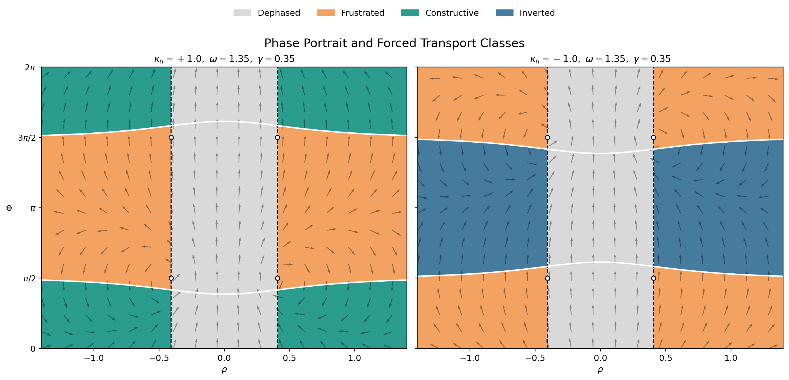

## Abstract

We study a minimal two-branch transport system motivated by non-associative octonionic structure and by projection onto a preferred transport slice. The fundamental observable is not a single projected amplitude but the conjugate-compatible pair of projected bracket completions
$$
A = P_u((ab)c), \qquad B = P_u(a(bc)),
$$
with transport-coherence invariant
$$
\mathcal{I} = A \overline{B}.
$$
We introduce a signed coupling
$$
\kappa_{u}(a,b,c) = \kappa_0 \frac{\langle u,[a,b,c]\rangle}{\Lambda^3}
$$
and analyze the minimal symmetry-compatible evolution equations
$$
\dot{A} = (u\omega - \gamma)A + \kappa_{u}\,\overline{B}, \qquad
\dot{B} = (u\omega - \gamma)B + \kappa_{u}\,\overline{A}.
$$
After passing to adapted variables $(R,\rho,\Phi)$, we derive the exact reduced system, identify the fixed-point structure, and show that the phase portrait is organized by two geometric boundaries: a locking boundary and a persistence boundary. Away from these marginal boundaries, the dynamics separates into four transport classes: constructive, inverted, frustrated, and dephased. The key point is methodological: once the minimal two-branch ansatz is granted, the classification follows from the geometry of the reduced system.

## 1. Introduction

The aim of this paper is deliberately narrow. We isolate one reduced dynamical problem: projected octonionic amplitudes naturally occur in two bracket-dependent branches, these branches admit a minimal conjugate-paired dynamics, and that dynamics has a rigid phase portrait with a forced transport classification.

The present paper is meant to stand on its own. The guiding question is straightforward: given the two-branch amplitude picture and the minimal evolution ansatz, what exactly follows?

The answer is stronger than a qualitative story. The reduced system can be derived exactly, its fixed points can be classified, and the phase space is partitioned by explicit geometric boundaries. That is the content of the paper.

## 2. Setup and Assumptions

### 2.1. Transport slice and branch amplitudes

Let $\mathbb{O}$ denote the octonions, let $u \in \mathrm{Im}\,\mathbb{O}$ be a chosen imaginary transport axis, and let
$$
P_u : \mathbb{O} \to \mathbb{C}_u \cong \mathbb{C}
$$
be projection onto the complex slice generated by $1$ and $u$.

For bulk elements $a,b,c \in \mathbb{O}$, define the projected branch amplitudes
$$
A = P_u((ab)c), \qquad B = P_u(a(bc)).
$$
Because octonionic multiplication is non-associative, $A$ and $B$ need not agree. The basic observable retained here is the transport-coherence invariant
$$
\mathcal{I} = A \overline{B}.
$$

### 2.2. Signed transport coupling

The octonionic associator
$$
[a,b,c] = (ab)c - a(bc)
$$
lives in $\mathrm{Im}\,\mathbb{O}$. Since $u$ is also imaginary, the inner product $\langle u,[a,b,c]\rangle$ defines a natural signed scalar. We set
$$
\kappa_{u}(a,b,c) = \kappa_0 \frac{\langle u,[a,b,c]\rangle}{\Lambda^3},
$$
where $\Lambda$ is a bulk scale and $\kappa_0$ is a transport coupling constant.

The sign of $\kappa_{u}$ matters. It distinguishes alignment from anti-alignment of the associator with the transport axis and is what later permits constructive versus inverted coherence.

### 2.3. Dynamical ansatz

The branch amplitudes are taken to satisfy the minimal conjugate-paired system
$$
\dot{A} = (u\omega - \gamma)A + \kappa_{u}\,\overline{B},
$$
$$
\dot{B} = (u\omega - \gamma)B + \kappa_{u}\,\overline{A},
$$
where $\omega$ is the transport rotation frequency, $\gamma \ge 0$ is a loss rate into unresolved structure, and $\kappa_{u}$ is the signed branch coupling.

The logical status of these equations should be stated explicitly. They constitute a minimal symmetry-compatible ansatz, they are not derived here from a variational principle on the octonionic bulk, and all theorem-level statements below are conditional on adopting them. The term "minimal" refers here to linearity in the branch amplitudes, invariance under common $U(1)_u$ phase rotation, symmetry under interchange of the two branches, and coupling of each branch to its partner only through conjugation.

## 3. Exact Reduction

Write
$$
A = r_1 e^{u\theta_1}, \qquad B = r_2 e^{u\theta_2},
$$
and define
$$
\Phi = \theta_1 + \theta_2.
$$
Then the amplitude equations reduce to
$$
\dot{r}_1 = -\gamma r_1 + \kappa_{u} r_2 \cos\Phi,
$$
$$
\dot{r}_2 = -\gamma r_2 + \kappa_{u} r_1 \cos\Phi,
$$
$$
\dot{\Phi} = 2\omega - \kappa_{u}\left(\frac{r_2}{r_1} + \frac{r_1}{r_2}\right)\sin\Phi.
$$

Now introduce the adapted variables
$$
R = \sqrt{r_1 r_2}, \qquad
\rho = \frac{1}{2}\ln\frac{r_1}{r_2}, \qquad
\Phi = \theta_1 + \theta_2.
$$
Since $r_1 = Re^\rho$ and $r_2 = Re^{-\rho}$, one has
$$
\frac{r_2}{r_1} + \frac{r_1}{r_2} = 2\cosh(2\rho).
$$
The phase reduction is exact because the ansatz depends on the branch phases only through the combination $\theta_1+\theta_2$. No independent evolution equation for $\theta_1-\theta_2$ survives in the reduced system. In these adapted variables,
$$
\mathcal{I} = A\overline{B} = R^2 e^{u\Phi},
$$
so $|\mathcal{I}| = R^2$ and $\arg(\mathcal{I}) = \Phi$.

### Proposition 1

The two-branch dynamics reduce exactly to
$$
\dot{R} = R\left(-\gamma + \kappa_{u} \cosh(2\rho)\cos\Phi\right),
$$
$$
\dot{\rho} = -\kappa_{u} \sinh(2\rho)\cos\Phi,
$$
$$
\dot{\Phi} = 2\omega - 2\kappa_{u} \cosh(2\rho)\sin\Phi.
$$

#### Proof

For $R$,
$$
\dot{R} = \frac{1}{2R}(r_2\dot{r}_1 + r_1\dot{r}_2)
$$
and substituting the equations for $\dot{r}_1,\dot{r}_2$ gives
$$
\dot{R}
= \frac{1}{2R}\left(-2\gamma r_1r_2 + \kappa_{u}(r_1^2+r_2^2)\cos\Phi\right).
$$
Using $r_1r_2 = R^2$ and $r_1^2+r_2^2 = 2R^2\cosh(2\rho)$ yields the first equation.

For $\rho$,
$$
\dot{\rho}
= \frac{1}{2}\left(\frac{\dot{r}_1}{r_1} - \frac{\dot{r}_2}{r_2}\right)
= \frac{\kappa_{u}\cos\Phi}{2}\left(\frac{r_2}{r_1} - \frac{r_1}{r_2}\right)
= -\kappa_{u} \sinh(2\rho)\cos\Phi.
$$

For $\Phi$, write
$$
\dot{A} = (\dot{r}_1 + u r_1\dot{\theta}_1)e^{u\theta_1},
\qquad
\dot{B} = (\dot{r}_2 + u r_2\dot{\theta}_2)e^{u\theta_2}.
$$
Multiplying the first equation on the right by $e^{-u\theta_1}$ gives
$$
\dot{r}_1 + u r_1\dot{\theta}_1
= (u\omega-\gamma)r_1 + \kappa_{u}r_2 e^{-u(\theta_1+\theta_2)}.
$$
Taking the $u$-imaginary part yields
$$
r_1\dot{\theta}_1 = \omega r_1 - \kappa_{u} r_2 \sin\Phi.
$$
The same step for $B$ gives
$$
r_2\dot{\theta}_2 = \omega r_2 - \kappa_{u} r_1 \sin\Phi.
$$
Adding these relations and dividing by the corresponding amplitudes yields
$$
\dot{\Phi} = \dot{\theta}_1 + \dot{\theta}_2
= 2\omega - \kappa_{u}\left(\frac{r_2}{r_1} + \frac{r_1}{r_2}\right)\sin\Phi,
$$
and substitution of the hyperbolic identity gives the claimed formula. This proves the proposition.

### Proposition 2

The effective coupling
$$
\kappa_{\mathrm{eff}} = \kappa_{u} \cosh(2\rho)
$$
satisfies
$$
|\kappa_{\mathrm{eff}}| \ge |\kappa_{u}|,
$$
with equality iff $\rho = 0$. Thus branch asymmetry strictly enhances phase locking away from the symmetric sector.

#### Proof

This is immediate from $\cosh(2\rho) \ge 1$, with equality only at $\rho=0$. This proves the proposition.

The symmetric sector is therefore the most restrictive locking case, not the generic one.

## 4. Geometric Boundaries

Two boundaries organize the reduced dynamics.

### 4.1. Locking boundary

Phase locking requires
$$
|\sin\Phi| = \left|\frac{\omega}{\kappa_{u} \cosh(2\rho)}\right| \le 1,
$$
hence
$$
|\omega| \le |\kappa_{u}| \cosh(2\rho).
$$
We call
$$
|\omega| = |\kappa_{u}| \cosh(2\rho)
$$
the locking boundary.

### 4.2. Persistence boundary

Amplitude persistence is determined by the sign of $\dot{R}/R$, namely
$$
\frac{\dot{R}}{R} = -\gamma + \kappa_{u}\cosh(2\rho)\cos\Phi.
$$
Marginal persistence occurs when
$$
\kappa_{u}\cosh(2\rho)\cos\Phi = \gamma.
$$
We call this the persistence boundary.

It is useful to define the order parameter
$$
\mathcal{O} = \kappa_{u} \cos\Phi.
$$
Then
$$
\frac{\dot{R}}{R} = -\gamma + \mathcal{O}\cosh(2\rho),
$$
and the persistence boundary becomes
$$
\mathcal{O}\cosh(2\rho) = \gamma.
$$

## 5. Fixed Points and Stability

We now analyze the $(\rho,\Phi)$ subsystem.

### 5.1. Symmetric branch

From $\dot{\rho} = 0$, one possibility is
$$
\rho^* = 0.
$$
Then $\dot{\Phi}=0$ gives
$$
\sin\Phi^* = \frac{\omega}{\kappa_{u}}.
$$
These fixed points exist when $|\omega| \le |\kappa_{u}|$.

The Jacobian of the $(\rho,\Phi)$ subsystem is
$$
J =
\begin{pmatrix}
-2\kappa_{u}\cosh(2\rho)\cos\Phi & \kappa_{u}\sinh(2\rho)\sin\Phi \\
-4\kappa_{u}\sinh(2\rho)\sin\Phi & -2\kappa_{u}\cosh(2\rho)\cos\Phi
\end{pmatrix}.
$$
At $\rho^*=0$ this simplifies to
$$
J|_{\rho^*=0}
= -2\kappa_{u}\cos\Phi^* \, I.
$$

### Proposition 3

The symmetric fixed points are nodes with double eigenvalue
$$
\lambda = -2\kappa_{u}\cos\Phi^* = -2\mathcal{O}.
$$
They are stable iff $\mathcal{O}>0$ and unstable iff $\mathcal{O}<0$.

#### Proof

At $\rho^*=0$ the Jacobian is a scalar multiple of the identity, so both eigenvalues equal $-2\kappa_{u}\cos\Phi^*$. The sign determines stability. This proves the proposition.

### 5.2. Complementary branch

The other fixed-point condition from $\dot{\rho}=0$ is
$$
\cos\Phi^* = 0,
$$
that is, $\Phi^* = \pi/2$ or $3\pi/2$. Then $\dot{\Phi}=0$ becomes
$$
\cosh(2\rho^*) = \left|\frac{\omega}{\kappa_{u}}\right|.
$$
Such fixed points exist only when $|\omega| \ge |\kappa_{u}|$.

### Proposition 4

The complementary fixed points are center equilibria in the $(\rho,\Phi)$ subsystem and always correspond to decaying amplitude in the full reduced system.

#### Proof

At $\cos\Phi^*=0$, the Jacobian has zero trace and determinant
$$
4\kappa_{u}^2 \sinh^2(2\rho^*),
$$
so its eigenvalues are purely imaginary:
$$
\lambda = \pm 2i|\kappa_{u}|\sinh(2\rho^*) .
$$
At the same points one has $\mathcal{O} = \kappa_{u}\cos\Phi^* = 0$, and therefore
$$
\frac{\dot{R}}{R} = -\gamma < 0.
$$
Accordingly, the motion in $(\rho,\Phi)$ is center-like while the amplitude decays monotonically to zero. This proves the proposition.

### 5.3. Symmetric-sector stability

Because $\sinh(0)=0$, the line $\rho=0$ is invariant. Linearizing $\dot{\rho}$ at small $\rho$ gives
$$
\dot{\rho} \approx -2\kappa_{u}\cos\Phi \, \rho = -2\mathcal{O}\rho.
$$
Thus the same quantity controlling node stability also controls transverse attraction to or repulsion from the symmetric sector.

## 6. Forced Classification

We now state the main result.

### Theorem 1

Away from the locking and persistence boundaries, the reduced phase space is partitioned into four disjoint transport classes, namely constructive, inverted, frustrated, and dephased. The boundary sets themselves are marginal transition loci and do not constitute additional open classes. The classification is forced by the reduced dynamics and is not an external interpretive addition.

#### Proof

There are two binary decisions built into the reduced system. First, locking either holds or fails:
$$
|\omega| < |\kappa_{u}|\cosh(2\rho)
\quad \text{or} \quad
|\omega| > |\kappa_{u}|\cosh(2\rho).
$$
Equality defines the locking boundary and corresponds to marginal locking. Failure of locking gives the dephased class.

Second, within the locked region, persistence either holds or fails:
$$
\kappa_{u}\cosh(2\rho)\cos\Phi > \gamma
\quad \text{or} \quad
\kappa_{u}\cosh(2\rho)\cos\Phi < \gamma.
$$
Equality defines the persistence boundary and corresponds to marginal persistence. Failure of persistence gives the frustrated class.

Within the persistent locked region, the sign of $\kappa_{u}$ distinguishes constructive from inverted coherence: $\kappa_{u} > 0$ gives constructive states, whereas $\kappa_{u} < 0$ gives inverted states. In the inverted class the persistence inequality requires $\cos\Phi < 0$, so the locked phase lies on the complementary sign branch relative to the constructive case. These possibilities are mutually exclusive and exhaustive on the complement of the boundary sets. This proves the theorem.

The four classes are summarized in Table 1.

| Class | Conditions | Fixed-point type | Reading |
|---|---|---|---|
| Constructive | $\kappa_{u}>0$, locked, persistent | stable node | long-lived coherent transport |
| Inverted | $\kappa_{u}<0$, locked, persistent | stable node | phase-inverted coherent transport |
| Frustrated | locked, not persistent | unstable node or decay-dominated locked motion | decaying resonance |
| Dephased | not locked | no persistent fixed point | incoherent transport |

### Corollary 1

A state away from the marginal boundaries is particle-like if and only if it satisfies both
$$
|\omega| < |\kappa_{u}|\cosh(2\rho)
$$
and
$$
\kappa_{u}\cosh(2\rho)\cos\Phi > \gamma.
$$

#### Proof

The first inequality is exactly the interior locking criterion; the second is exactly the persistence criterion. The theorem shows that both are jointly necessary and sufficient for membership in the coherent transport classes away from the marginal boundaries. This proves the corollary.

## 7. Phase Portrait Figure

Figure 1 should be read as part of the theorem, not as decoration. It displays the geometry behind the classification in two representative panels, one for $\kappa_{u} > 0$ showing constructive, frustrated, and dephased regions, and one for $\kappa_{u} < 0$ showing inverted, frustrated, and dephased regions.

{fig-pos="htbp" width=95%}

A reproducibility script used to generate Figure 1 is included with the source files for this paper.

## 8. What Is and Is Not Claimed

This paper proves statements about the reduced two-branch system. It does not provide a first-principles octonionic variational derivation of the branch equations, a field-theoretic identification of $\gamma$ or $\kappa_{u}$, or a physical interpretation of the transport classes beyond the reduced model. What is established is narrower and cleaner: the exact reduced system, asymmetry-enhanced locking, the node-versus-center fixed-point structure, the geometric boundaries, the forced four-class partition, and the particle-like criterion.

## 9. Conclusion

The main result of this paper is structural. Once the minimal two-branch ansatz is granted, the reduced dynamics is rigid enough to force a transport classification. The geometry of the locking and persistence boundaries leaves no ambiguity about the coarse transport regimes available to the system. In that sense the classification is not a metaphor for the dynamics; it is a consequence of the dynamics.

The most important next step is equally clear: derive the two-branch evolution equations from a variational principle or another first-principles bulk construction. Until then, the right claim is the modest one made here: conditional on the minimal ansatz, the phase portrait and transport classification are exact.
