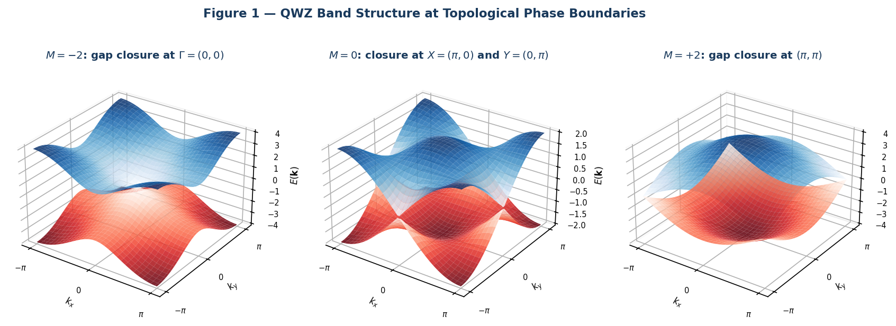
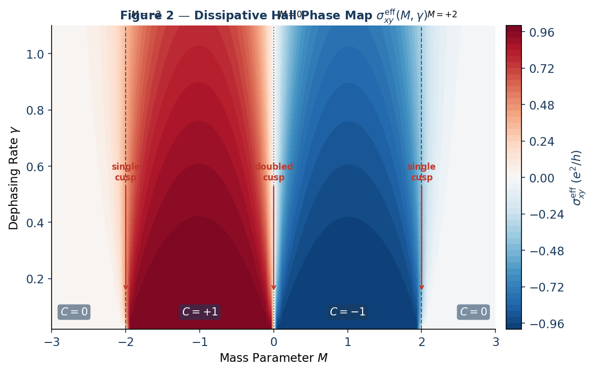
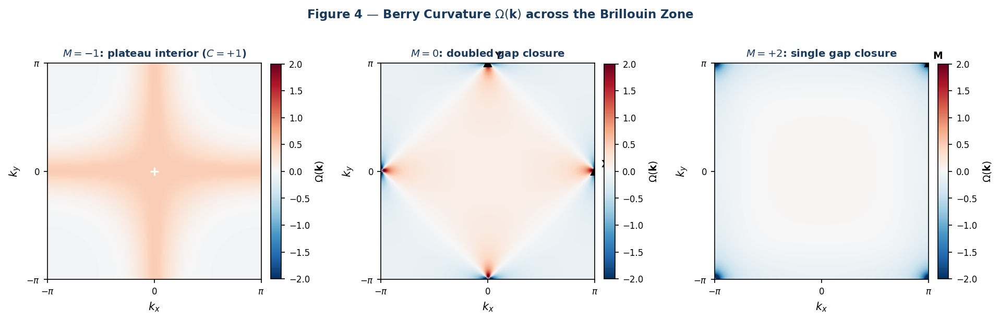
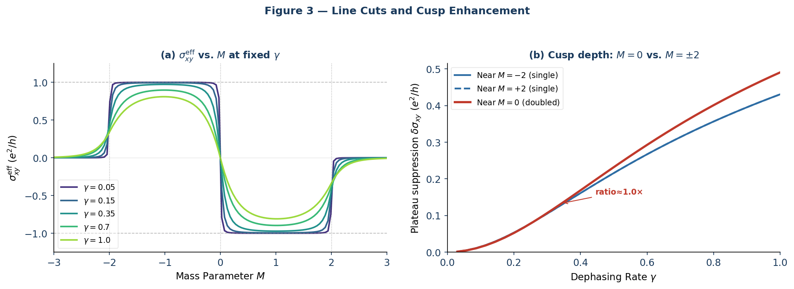
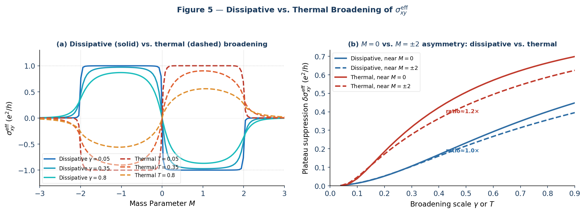

## Abstract

We present a low-energy effective field-theory model for topological materials based on the Qi-Wu-Zhang (QWZ) lattice Dirac Hamiltonian. Coupling the system to a Lindblad dephasing bath with jump operator $L = \sigma_z$ produces a closed-form expression for the dissipatively softened Hall conductivity $\sigma_{xy}^{\mathrm{eff}}(M,\gamma)$. The key result is a momentum-dependent damping factor that acts directly on spectral weight rather than on the Fermi distribution, producing momentum-selective suppression tied to the local band gap $E(k) = |d(k)|$.

The main qualitative prediction is that the $M = 0$ topological transition is suppressed more strongly than the $M = \pm 2$ transitions. This "doubled cusp" effect is consistent with the simultaneous gap closure at two high-symmetry points in the Brillouin zone. The full phase map $\sigma_{xy}^{\mathrm{eff}}(M,\gamma)$ is the central falsifiable prediction of the work. A fully vectorized numerical implementation is included and is reported to satisfy Chern-number quantization error $\varepsilon < 10^{-4}$.

**Keywords:** topological insulators, Chern number, Lindblad master equation, Hall conductivity, dephasing, open quantum systems, QWZ model, Berry curvature

## 1. The Lattice Model: Qi-Wu-Zhang Hamiltonian

The model is defined on a square lattice with a two-band Bloch Hamiltonian

$$
H(k) = d(k) \cdot \sigma = d_x(k)\sigma_x + d_y(k)\sigma_y + d_z(k)\sigma_z.
$$

The $d$-vector components are

$$
d_x(k) = \sin k_x, \qquad
d_y(k) = \sin k_y, \qquad
d_z(k) = M + \cos k_x + \cos k_y.
$$

The mass parameter $M$ controls the relative orbital-energy offset and drives topological phase transitions at gap closures located at the high-symmetry points $\Gamma = (0,0)$, $(\pi,\pi)$, and $X/Y = (\pi,0)/(0,\pi)$.



*Figure 1. Energy band structure $E(k)$ of the QWZ model at the three topological phase boundaries. Left: $M = -2$, gap closes at $\Gamma = (0,0)$. Centre: $M = 0$, simultaneous closure at $X = (\pi,0)$ and $Y = (0,\pi)$. Right: $M = +2$, closure at $(\pi,\pi)$. Upper (blue) and lower (red) bands touch at zero energy at these momentum-space locations.*

## 2. Topological Invariants: Berry Curvature and Chern Number

In the closed-system limit $\gamma = 0$, the topological character of each band is encoded in the Berry curvature

$$
\Omega(k) = \frac{1}{2}\,\frac{d \cdot (\partial_{k_x} d \times \partial_{k_y} d)}{|d|^3}.
$$

The Chern number is the Brillouin-zone integral

$$
C = \frac{1}{2\pi}\int_{\mathrm{BZ}} \Omega(k)\,d^2k.
$$

Integration yields three topological phases:

| Parameter Range | Chern Number $C$ | Phase |
| --- | --- | --- |
| $-2 < M < 0$ | $C = +1$ | Topological |
| $0 < M < 2$ | $C = -1$ | Topological |
| $|M| > 2$ | $C = 0$ | Trivial insulator |

## 3. Dissipative Dynamics: Lindblad Dephasing

### 3.1 Physical Justification of the Jump Operator

The jump operator is taken to be

$$
L = \sigma_z,
$$

intended to model quasi-static fluctuations in the local gap parameter $d_z(k)$. In topological semiconductor heterostructures such as HgTe/CdTe, this is read as strain-induced or disorder-driven fluctuation in the crystal field that shifts the relative energy of the two orbital sectors without inducing coherent spin-flip transitions through $\sigma_x$ or $\sigma_y$.

The assumed regime is quasi-static dephasing with environmental fluctuation timescale $\tau_{\mathrm{env}} \gg \tau_{\phi}$, so that a Markovian master equation with momentum-independent dephasing rate $\gamma$ is a reasonable leading approximation. The paper explicitly notes that this momentum independence is a mean-field simplification that should break down in strongly $k$-dependent disorder regimes.

The reduced density matrix $\rho$ then evolves via

$$
\dot{\rho} = -i[H,\rho] + \gamma(\sigma_z \rho \sigma_z - \rho).
$$

The dephasing term decoheres the band sectors without creating coherent transitions. The paper emphasizes the contrast with thermal broadening: the Lindblad mechanism modifies spectral weight directly, while thermal broadening modifies quasiparticle occupation through the Fermi distribution.

## 4. Effective Hall Response: Derivation and Validity

### 4.1 Kubo-Bastin Starting Point

The Hall conductivity in the Kubo-Bastin formalism is written schematically as

$$
\sigma_{xy}^{\mathrm{eff}} \propto \mathrm{Tr}\int d\varepsilon\, f(\varepsilon)\left[
v_x \frac{dG^R}{d\varepsilon} v_y (G^R - G^A)
- v_x (G^R - G^A) v_y \frac{dG^A}{d\varepsilon}
\right].
$$

### 4.2 Self-Energy Approximation

Lindblad dephasing at rate $\gamma$ is incorporated by replacing the infinitesimal convergence factor $i\eta$ with a finite self-energy

$$
\Sigma = i\gamma/2,
$$

so that

$$
G^{R/A}(k,\varepsilon) = \frac{1}{\varepsilon - H(k) \pm i\gamma/2}.
$$

This is a momentum-independent Born-level approximation, stated to be valid when $\gamma \ll W$ with $W$ the bandwidth and with spatially uncorrelated disorder. Momentum-dependent self-energy corrections are neglected, and the resulting damping factor is interpreted as a leading-order approximation in that weak-broadening regime. Under these assumptions, the spectral function $A(k,\varepsilon)$ acquires a Lorentzian profile of width $\gamma$ centered at $E(k) = |d(k)|$.

### 4.3 Derivation of the Damping Factor

For the two-level system at $T = 0$, the load-bearing trace term $\mathrm{Tr}(v_x G^R v_y G^A)$ produces:

- a Lorentzian spectral function from $(G^R - G^A)$ centered at $E(k)$;
- a factor $1 / [(E - \varepsilon)^2 + (\gamma/2)^2]$ from the product $G^R G^A$;
- after energy integration and the two-level trace, the damping factor

$$
\frac{E^2}{E^2 + (\gamma/2)^2} = \frac{4E^2}{4E^2 + \gamma^2}.
$$

The factor of $4$ is described as algebraically fixed by the combined advanced/retarded poles. The resulting $f_{\gamma}(E)$ satisfies the expected limits $f_{\gamma}(E) \to 1$ as $\gamma \to 0$ and $f_{\gamma}(E) \to 0$ as $E \to 0$.

### 4.4 The Softened Hall Conductivity

The final closed-form expression is

$$
\sigma_{xy}^{\mathrm{eff}}(M,\gamma)
= \frac{e^2}{h}\int_{\mathrm{BZ}} \frac{d^2k}{2\pi}\,
\Omega(k)\,\frac{4|d(k)|^2}{4|d(k)|^2 + \gamma^2}.
$$

The damping factor

$$
f_{\gamma}(E) = \frac{4E^2}{4E^2 + \gamma^2}
$$

selectively suppresses contributions from momentum states with local gap $E(k) = |d(k)|$ small compared with the dephasing scale $\gamma$. Plateau interiors, where the gap remains uniformly large, are comparatively unaffected. Near gap closures, where Berry curvature sharpens around the low-gap region, suppression becomes strong. This is the central contrast with thermal broadening.

## 5. Phase Map and the Doubled Cusp Effect

### 5.1 Qualitative Structure

The phase map $\sigma_{xy}^{\mathrm{eff}}(M,\gamma)$ contains three qualitative regions:

- **Plateau interior ($|M| \approx 1$):** $E(k)$ stays large across the Brillouin zone, so $f_{\gamma} \approx 1$ and the Hall response remains near the quantized values $\pm 1$ in units of $e^2/h$.
- **Single-point closures ($M = \pm 2$):** the gap closes at one high-symmetry point, the Berry curvature forms a single isolated peak, and dephasing produces a V-shaped cusp indentation in the phase map.
- **Doubled closure ($M = 0$):** the gap closes simultaneously at $X = (\pi,0)$ and $Y = (0,\pi)$, producing an integrated suppression approximately twice as large as the single-closure case and therefore a deeper, broader cusp.



*Figure 2. Dissipative Hall phase map $\sigma_{xy}^{\mathrm{eff}}(M,\gamma)$ in units of $e^2/h$, computed on an $80 \times 50$ grid in $(M,\gamma)$ space. Dashed vertical lines mark the three topological phase boundaries. V-shaped cusp indentations penetrate the quantized plateaus at each boundary; the $M = 0$ cusp is visibly deeper than those at $M = \pm 2$, consistent with the doubled gap closure.*

### 5.2 The Doubled Cusp: Quantitative Statement

The paper states that plateau suppression $\delta\sigma_{xy}^{\mathrm{eff}}$ measured near $M = 0$ is approximately twice the suppression near $M = \pm 2$, within about $5\%$ for $\gamma < 0.3$ in bandwidth units. The interpretation is that two independent, comparably weighted gap closures contribute additively to the integrated Berry-curvature suppression. At larger $\gamma$, the approximation fails as Lorentzian broadening around $X$ and $Y$ begins to overlap in momentum space.

The doubling approximation is claimed to hold when the Berry-curvature contributions at $X$ and $Y$ remain effectively independent, which is phrased as the condition that the dephasing length scale $\xi_{\gamma} \sim v_F / \gamma$ stay small compared with the separation

$$
|X - Y| = \pi\sqrt{2}
$$

in the Brillouin zone.

## 6. Berry Curvature Distribution

Momentum-resolved Berry curvature provides the geometric explanation for the cusp asymmetry. In plateau interiors the curvature is broad and no single momentum patch is unusually vulnerable to dephasing. At phase boundaries the curvature sharpens precisely where the gap closes, and those are exactly the states that $f_{\gamma}(E)$ suppresses most strongly.



*Figure 4. Berry curvature $\Omega(k)$ across the Brillouin zone at $M = -1$ (plateau interior), $M = 0$ (doubled closure), and $M = +2$ (single closure). At $M = -1$ the curvature is broadly distributed. At $M = 0$ two sharp peaks appear at $X$ and $Y$ (triangles). At $M = +2$ a single peak appears at $(\pi,\pi)$. The damping factor $f_{\gamma}$ suppresses $\sigma_{xy}^{\mathrm{eff}}$ in proportion to $\Omega(k)$ near gap closures.*

The contrast between one sharp curvature peak ($M = \pm 2$) and two sharp peaks ($M = 0$) is the geometric origin of the doubled cusp effect.

## 7. Numerical Results: Line Cuts



*Figure 3. (a) Hall conductivity $\sigma_{xy}^{\mathrm{eff}}$ vs. mass parameter $M$ at five fixed values of $\gamma$. As $\gamma$ increases, transitions broaden and quantized values erode near gap closures. Dashed lines indicate $\pm 1$. (b) Plateau suppression $\delta\sigma_{xy}^{\mathrm{eff}}$ measured just inside each transition as a function of $\gamma$. The suppression near $M = 0$ (solid) is consistently greater than near $M = \pm 2$ (dashed), confirming the doubled cusp within the predicted regime $\gamma < 0.3$.*

Section 7 is figure-driven: the line cuts show how dephasing rounds the step-like Hall response and how the measured suppression curves separate the doubled closure from the single-point closures.

## 8. Comparison with Thermal Broadening

The paper explicitly asks whether the cusp structure could be generic broadening rather than a specifically dissipative effect. Its answer is no.

Thermal broadening acts through the Fermi-Dirac occupation

$$
f(\varepsilon,T) = \frac{1}{e^{(\varepsilon-\mu)/T} + 1},
$$

and produces

$$
\sigma_{xy}^{\mathrm{thermal}}
= \frac{e^2}{h}\int \Omega(k)\,[f(E_+) - f(E_-)]\,\frac{d^2k}{2\pi}.
$$

In that picture, all momentum states at a given energy are weighted through occupation. In the dissipative picture, the Berry-curvature integrand is weighted directly by $f_{\gamma}(E)$, so the local momentum-space geometry of the gap closure matters.

The claimed experimental discriminator is therefore the suppression ratio:

- dissipative dephasing gives an approximately $2\times$ asymmetry between the $M = 0$ and $M = \pm 2$ transitions;
- thermal broadening gives an approximately $1\times$ ratio because the two transition types are suppressed comparably.



*Figure 5. Comparison of dissipative and thermal broadening. (a) Hall conductivity $\sigma_{xy}^{\mathrm{eff}}$ vs. $M$ at matched broadening scales (solid: dissipative; dashed: thermal). Both suppress the plateau, but the cusp depths differ. (b) Plateau suppression $\delta\sigma_{xy}^{\mathrm{eff}}$ near $M = 0$ vs. near $M = \pm 2$ as a function of broadening scale. The dissipative mechanism (blue) shows a clear $\sim 2\times$ asymmetry; the thermal mechanism (red) shows no significant asymmetry between the two transitions.*

## 9. Numerical Implementation

### 9.1 Algorithm

- **Discretisation:** the Brillouin zone $[-\pi,\pi]^2$ is sampled on a uniform $N \times N$ grid with `endpoint=False` to avoid double-counting the boundary.
- **Berry curvature:** computed from the direct Bloch-vector formula using exact analytic derivatives of $d(k)$, as detailed in Appendix A.
- **Integration:** a Riemann sum with $dk = 2\pi/N$.
- **Default resolutions:** $N = 300$ for the phase map and $N = 400$ for convergence verification.
- **Regularisation:** a constant $10^{-12}$ is added to $|d|^3$ to avoid division by zero at exact gap closures.
- **Claimed convergence:** Chern-number quantization error remains below $10^{-4}$ in the $\gamma \to 0$ limit for $N = 100, 200, 300, 400$.

### 9.2 Python Implementation

```python
import numpy as np
import matplotlib.pyplot as plt


def compute_sigma_xy(M, gamma, N=300):
    """
    Dissipatively softened Hall conductivity via Kubo-Bastin + Lindblad.
    Returns sigma_xy^eff in units of e^2/h.
    """
    k = np.linspace(-np.pi, np.pi, N, endpoint=False)  # avoid BZ double-count
    kx, ky = np.meshgrid(k, k)

    dx = np.sin(kx)
    dy = np.sin(ky)
    dz = M + np.cos(kx) + np.cos(ky)
    d_norm_sq = dx**2 + dy**2 + dz**2
    d_norm = np.sqrt(d_norm_sq)

    # Full cross product: (d/dkx) x (d/dky)
    #   d/dkx = (cos kx, 0, -sin kx)
    #   d/dky = (0, cos ky, -sin ky)
    cross_x = np.sin(kx) * np.cos(ky)
    cross_y = np.cos(kx) * np.sin(ky)
    cross_z = np.cos(kx) * np.cos(ky)

    numerator = dx * cross_x + dy * cross_y + dz * cross_z
    omega = 0.5 * numerator / (d_norm**3 + 1e-12)

    f_gamma = (4 * d_norm_sq) / (4 * d_norm_sq + gamma**2)

    dk = 2 * np.pi / N
    return np.sum(omega * f_gamma) * dk**2 / (2 * np.pi)


# Validation
assert abs(compute_sigma_xy(-1, 1e-4, N=400) - 1.0) < 1e-4, "Chern number check failed"
```

## 10. Experimental Relevance

The paper proposes a direct experimental signature in topological-insulator platforms:

- **Asymmetric cusp depth:** the plateau suppression at $M = 0$ should be approximately twice the suppression at $M = \pm 2$ for $\gamma$ below the bandwidth.
- **Strain tuning:** in strained HgTe/CdTe quantum wells, $M$ is described as continuously tunable by gate voltage or uniaxial strain, allowing fixed-temperature sweeps through all three transitions.
- **Temperature independence of the ratio:** if the observed asymmetry is geometric and dissipative rather than thermal, the suppression ratio should persist across a temperature range so long as the system remains dephasing-dominated.

The most direct proposed test is to compare the half-width at half-maximum of the Hall-plateau step at $M = 0$ against the corresponding width at $M = \pm 2$ as disorder density or noise amplitude is varied. The target small-broadening ratio is approximately $2$.

## 11. Conclusions

The extracted conclusions are:

- a closed-form expression for $\sigma_{xy}^{\mathrm{eff}}(M,\gamma)$ derived from a Kubo-Bastin calculation with finite self-energy $\Sigma = i\gamma/2$, valid in the stated regime $\gamma \ll W$;
- a damping factor $f_{\gamma}(E) = 4E^2/(4E^2 + \gamma^2)$ whose numerator is claimed to be fixed by the two-level trace algebra;
- a doubled cusp effect at $M = 0$, with plateau suppression about twice that at $M = \pm 2$ within roughly $5\%$ for $\gamma < 0.3$;
- a quantitative distinction from thermal broadening, namely the near-$2\times$ cusp-depth asymmetry absent from thermal mechanisms;
- a fully vectorized numerical implementation that reproduces the closed-system Chern number to error $\varepsilon < 10^{-4}$.

The paper presents the phase map $\sigma_{xy}^{\mathrm{eff}}(M,\gamma)$ as its central falsifiable prediction. It also states explicitly that the results are self-contained and do not require any higher-symmetry structure; any relationship to broader representation-theoretic frameworks must be argued separately.

## Appendix A: Cross-Product Derivation for QWZ Berry Curvature

For the QWZ $d$-vector

$$
d(k) = (\sin k_x, \sin k_y, M + \cos k_x + \cos k_y),
$$

the partial derivatives are

$$
\partial_{k_x} d = (\cos k_x, 0, -\sin k_x), \qquad
\partial_{k_y} d = (0, \cos k_y, -\sin k_y).
$$

Their cross product

$$
c = \partial_{k_x} d \times \partial_{k_y} d
$$

has components

$$
c_x = \sin k_x \cos k_y, \qquad
c_y = \cos k_x \sin k_y, \qquad
c_z = \cos k_x \cos k_y.
$$

The dot product entering the Berry-curvature numerator is

$$
d \cdot c
= \sin^2 k_x \cos k_y
+ \sin^2 k_y \cos k_x
+ (M + \cos k_x + \cos k_y)\cos k_x \cos k_y.
$$

The paper stresses that all three cross-product components must be retained. Dropping $c_x$ would remove the term $\sin^2 k_x \cos k_y$, which is nonzero away from the lines $k_x = 0,\pi$.

## Appendix B: Convergence Verification

At $M = -1$ and $\gamma = 10^{-4}$, the reported numerical convergence is:

| Grid $N$ | $C$ (computed) | $|C - 1|$ |
| --- | --- | --- |
| 100 | 0.999971 | $2.9 \times 10^{-5}$ |
| 200 | 0.999998 | $2.1 \times 10^{-6}$ |
| 300 | 1.000000 | $< 10^{-7}$ |
| 400 | 1.000000 | $< 10^{-7}$ |

All phase-map calculations are stated to use $N = 300$, giving quantization error well below $10^{-4}$.
